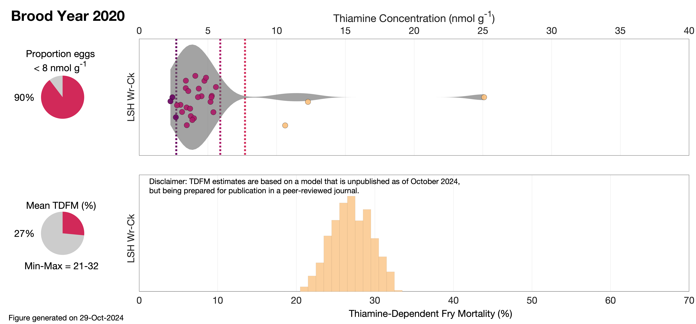
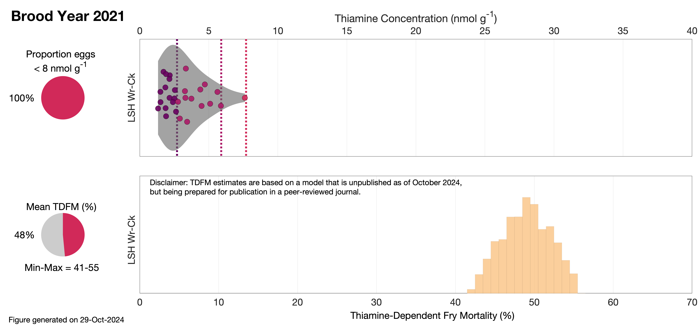
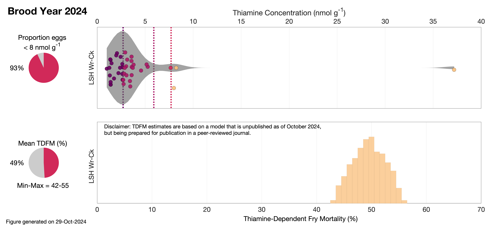

# Estimates of Thiamine-dependent fry mortality
Estimates of thiamine-dependent fry mortality for winter-run Chinook salmon

Last updated 10/29/2024, Miles Daniels (miles.daniels@noaa.gov)

### Methods: 
To estimate Thiamine-Dependent Fry Mortality (TDFM) in naturally spawning Chinook salmon, we used a two-step simulation-based approach. First, we developed a dose-response model based on laboratory data linking egg thiamine concentration to fry survival. Next, we applied this model to egg thiamine concentrations measured during hatchery sampling, assuming that these samples represent natural spawning populations in the same watershed. The dose-response model, built within a Bayesian framework, describes fry survival as a function of egg thiamine concentration. The model was simplified to fit key parameters, including survival limits and thiamine sensitivity (EC50). To estimate TDFM in hatchery or wild populations, thiamine concentrations were randomly resampled 10,000 times, and survival predictions were generated with corresponding uncertainty. All analyses were conducted in R using the RJAGS package, with results reported as survival percentages across multiple brood years.

We used a 4-parameter sigmoid dose-response model to represent the fry survival rate response to egg thiamine concentration:

 $$ Y = U+\frac{L-U}{1+(\frac{C}{EC50})^S}$$
 
Where: **_Y_** is fry survival (proportion); **_U_** and **_L_** are the upper and lower limits of survival (proportion), respectively; **_C_** is the observed thiamine concentration (nmol g  -1 ); **_EC50_** is the thiamine concentration at which the proportion of survival is estimated to be 1/2 of **_U_**; and **_S_** is the slope of the relationship.

Results from the dose-response model were used to generate the risk categories below based on EC50, EC90, and EC95. 

---

_Table 1: Risk categories for Thiamine-Dependent Fry Mortality based on egg thiamine concentration._
| Risk Category  | Thiamine Concentration (nmol g 	 -1  )|
|  :---:       |     :---:      |       
| severely impacted | < 2.7 |
| impacted  | > 2.7 - < 5. 9  |
| likely impacted  | > 5.9 - 7.7  |
| unlikely impacted  | > 7.7  |
---

### Results:

Below are results for estimating TDFM for years 2020 to 2024.  

_Table 2: Estimated Thiamine-Dependent Fry Mortality by year._
| Year  | TDFM (Mean %)| TDFM (5th %) | TDFM (95th %) |
|  :---:  |  :---: |    :---:   |  :---: |       
| 2020 | 26 | 17 | 37 |
| 2021 | 48 | 35 | 61 |
| 2022 | 51 | 38 | 65 |
| 2023 | 51 | 36 | 68 |
| 2024 | 49 | 35 | 63 |

Separate plots are also shown below for each year.

In the upper plot is a a pie chart that shows the percentage of eggs that were estimated to be below 8 nmol g  -1  and therefore expected to have some level of impact. Next to the pie chart is the distribution of egg thiamine concentrations from samples collected at the Livingston Stone National Fish Hatchery. The X-axis is the concentration of thiamine (nmol g  -1 ) and each dot represents an egg sample that is color coded to the risk category defined in Table 1. The shaded region is used to aid the reader in viewing the distribution of each the sample set. Additionally, the different risk categories are shown with color coded dashed lines.

In the lower plot is a a pie chart that shows the mean estimate of Thiamine-Dependent Fry Mortality (TDFM) as well as the 95% credible estimate. Next to the pie chart is the distribution of TDFM estimates generated from the 10,000 simulations which is used to estimate the mean and 95% credible estimate. 

---

---

---

---

---

---

